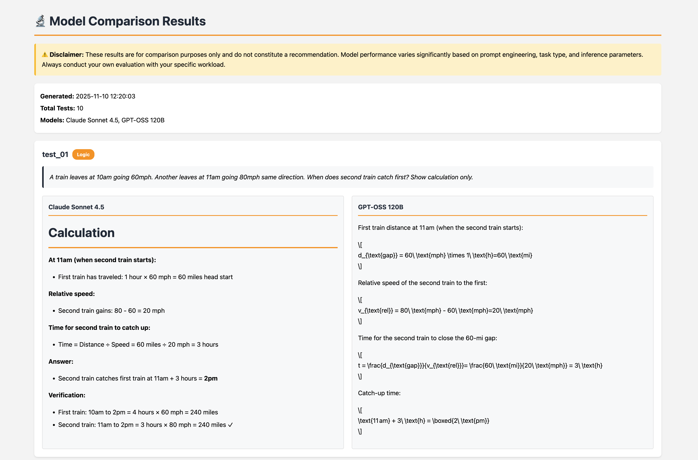

# Amazon Bedrock Model Comparison Framework

A systematic framework for evaluating and comparing foundation models on Amazon Bedrock. This project provides a reproducible methodology for collecting benchmark data, running parallel inference tests, and generating comparison reports.



## Overview

This framework demonstrates an approach to comparing multiple language models across published benchmarks, cost structures, and actual inference behavior. It was designed to address enterprise evaluation scenarios where teams need objective data for model selection decisions.

**Disclaimer**: This framework is provided for educational and evaluation purposes only. It does not constitute a recommendation for any specific model. Model performance varies significantly based on use case, prompt engineering, and inference parameters. Users must conduct their own evaluation with representative workloads before making decisions. Benchmark scores are sourced from vendor documentation and may not reflect performance on specific tasks. Pricing information is subject to change—verify current rates before production deployment.

## Features

- Benchmark aggregation from official vendor documentation
- Cost analysis across multiple usage scenarios
- Parallel inference testing framework
- Markdown and LaTeX rendering in output
- Multiple export formats (CSV, HTML)
- Customizable test prompts and models

## Models Compared

- Claude Sonnet 4.5 (`us.anthropic.claude-sonnet-4-5-20250929-v1:0`)
- GPT-OSS 120B (`openai.gpt-oss-120b-1:0`)

## Prerequisites

- Python 3.10+
- AWS account with Amazon Bedrock access
- IAM permissions for `bedrock:InvokeModel`
- Model access enabled for both models in target region
- Sufficient service quotas for parallel requests

## Installation

```bash
# Clone repository
git clone <repository-url>
cd bedrock-model-comparison

# Create virtual environment
python -m venv venv
source venv/bin/activate  # Windows: venv\Scripts\activate

# Install dependencies
pip install -r requirements.txt

# Configure AWS credentials
aws configure
```

## Usage

### Running the Notebook

```bash
jupyter notebook
```

Open `model_comparison_framework.ipynb` and execute cells sequentially.

### Expected Runtime

- Benchmark and cost analysis: < 30 seconds
- Parallel inference (10 tests): 2-4 minutes
- Export and visualization: < 30 seconds
- Total: approximately 3-5 minutes

### Output Files

Results are exported to `comparison_results/`:

1. **model_comparison_YYYYMMDD_HHMMSS.csv**: Raw inference results with timestamps
2. **side_by_side_comparison_YYYYMMDD_HHMMSS.csv**: Formatted comparison table
3. **comparison_view_YYYYMMDD_HHMMSS.html**: Interactive visualization with markdown/LaTeX rendering

The HTML file opens automatically in your default browser.

## Project Structure

```
bedrock-model-comparison/
├── model_comparison_framework.ipynb    # Main evaluation notebook
├── utils.py                            # Helper functions
├── requirements.txt                    # Python dependencies
├── README.md                          
├── .gitignore                         
└── comparison_results/                # Auto-generated output directory
```

## Configuration

### Adding Test Prompts

Edit `TEST_PROMPTS` in the notebook:

```python
TEST_PROMPTS = [
    {
        'id': 'test_01',
        'category': 'Logic',
        'prompt': 'Your test prompt here'
    }
]
```

### Adding Models

Update the `MODELS` dictionary:

```python
MODELS = {
    'Model Name': 'model.id.here',
    'Another Model': 'another.model.id'
}
```

### Adjusting Inference Parameters

Modify in `run_single_inference()`:

```python
kwargs = {
    'max_tokens': 500,
    'temperature': 0.7,
    'top_p': 0.9
}
```

### Parallel Execution Settings

Adjust `max_workers` in `run_parallel_batch()`:

```python
with ThreadPoolExecutor(max_workers=5) as executor:
```

## Cost Analysis Customization

Update scenarios in the notebook for your usage patterns:

```python
scenarios = [
    {
        'name': 'Your Scenario',
        'requests_per_day': 10000,
        'avg_input_tokens': 800,
        'avg_output_tokens': 500
    }
]
```

## Troubleshooting

### AccessDeniedException

Request model access in the Amazon Bedrock console. Access is typically granted immediately for base models.

### ThrottlingException

- Reduce `max_workers` value
- Increase sleep time between batches
- Request quota increase via AWS Service Quotas

### HTML Rendering Issues

- Verify internet connectivity (requires CDN access for rendering libraries)
- Check browser console for JavaScript errors
- Try an alternative browser

### Authentication Errors

Verify credentials:
```bash
aws sts get-caller-identity
```

Confirm region matches model availability.

## Extension Examples

### Large Test Sets

```python
# Run 100 tests in batches
for i in range(0, 100, 10):
    batch = TEST_PROMPTS[i:i+10]
    results = run_parallel_batch(batch, batch_num=i//10 + 1)
    all_results.extend(results)
    time.sleep(2)
```

### Custom Metrics

```python
def analyze_response(response):
    return {
        'length': len(response),
        'has_code': '```' in response,
        'has_math': '$' in response
    }

for result in all_results:
    result['analysis'] = analyze_response(result['response'])
```

## References

- [Amazon Bedrock Documentation](https://docs.aws.amazon.com/bedrock/)
- [Amazon Bedrock Pricing](https://aws.amazon.com/bedrock/pricing/)
- [Bedrock Model Evaluation Guide](https://docs.aws.amazon.com/bedrock/latest/userguide/model-evaluation.html)

## Evaluation Recommendations

For production model selection:

1. Test with representative prompts from your actual workload
2. Include domain-specific edge cases
3. Conduct human evaluation with subject matter experts
4. Measure latency and throughput under realistic load conditions
5. Calculate costs using actual traffic patterns
6. Run tests with sufficient sample size (100+ prompts recommended)
7. Consider model-specific capabilities beyond benchmarks

## License

This project is provided as-is for educational and evaluation purposes.